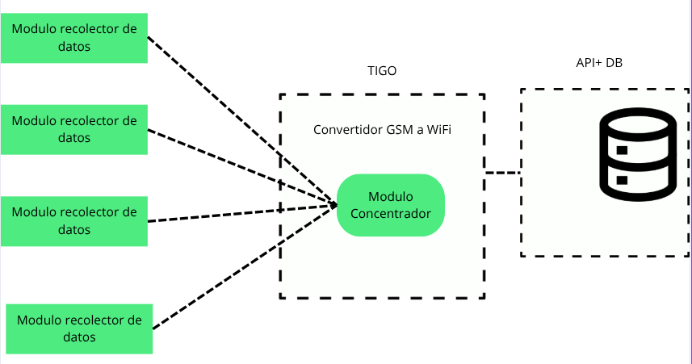
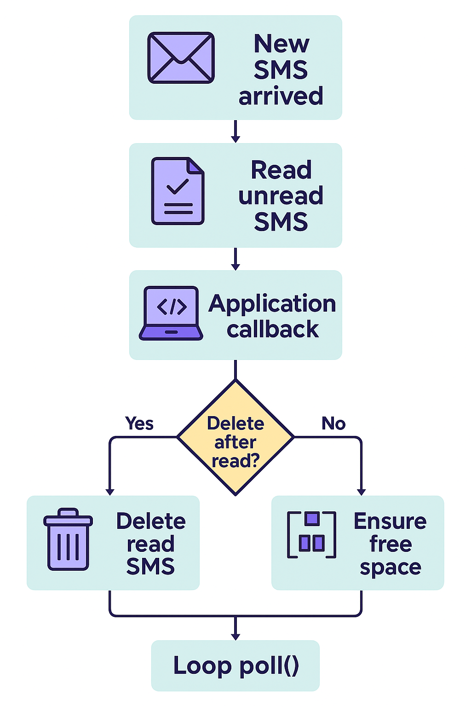

---

```markdown
# 📡 TIVEG Concentrador SMS → JSON → API  

> Firmware modular para **ESP32 + SIM800L** (TTGO T-Call / DualMCU ONE) que recibe SMS en formato PDU, los reconstruye, sanitiza y envía en **JSON** hacia una API HTTP/HTTPS.  

---

## 🖼️ Vista General  



---

## ✨ Características  

- 📥 Recepción de SMS en **PDU/UDH**.  
- 🧩 Ensamblado de mensajes largos con `SmsConcatManager`.  
- 🧹 Limpieza automática de memoria SIM (`AT+CMGD`).  
- 🗂️ Cola RAM (`JsonQueue`) para hasta **16 mensajes** pendientes.  
- 🌐 Envío confiable de JSON a **API HTTP/HTTPS**.  
- 🔄 Reconexión WiFi automática.  
- 🖥️ Modo consola (`###`) para pruebas directas con comandos AT.  

---

## 📂 Estructura de Archivos  

```

├── main.ino              # Código principal (URCs, barridos, envío API)
├── config.h              # Selección de tarjeta, pines y parámetros globales
├── secrets.h             # Credenciales privadas (SSID, password, API\_URL)
├── wifi\_config.h         # Conexión y reconexión WiFi
├── http\_utils.h          # Manejo de HTTP/HTTPS con retries
├── JsonQueue.h           # Cola FIFO de mensajes JSON
├── SIM800SmsManager.h    # Clase para comandos AT y envío de SMS
├── SIM800SmsManager.cpp
├── SmsPduParser.h        # Parser de PDU → texto
├── SmsPduParser.cpp
├── SmsConcatManager.h    # Ensamblado de SMS multipartes
├── SmsConcatManager.cpp

````

---

## ⚙️ Configuración  

### 🔑 `secrets.h`  

```cpp
#define WIFI_SSID     "MiRedWiFi"
#define WIFI_PASSWORD "MiPassword"
#define API_URL       "http://192.168.1.10:5000/api/data"
#define MIRROR_URL    ""   // opcional
````

### 🛠️ `config.h`

```cpp
#define USE_BOARD 0       // 0 = TTGO T-Call, 1 = DualMCU ONE
#define USE_HTTPS 1       // 0 = HTTP, 1 = HTTPS
#define HTTPS_INSECURE 1  // 0 = validar cert, 1 = ignorar (solo pruebas)
#define SIM_BAUD 9600
```

---

## 🔄 Flujo del Concentrador

El proceso interno del firmware:

| Paso | Acción                                                      |
| ---- | ----------------------------------------------------------- |
| 1    | Conexión WiFi (autoreconexión incluida).                    |
| 2    | Configuración del SIM800L (modo PDU, almacenamiento en ME). |
| 3    | Recepción de SMS (URC `+CMTI`).                             |
| 4    | Parseo de PDU → texto (`SmsPduParser`).                     |
| 5    | Ensamblado de multipartes (`SmsConcatManager`).             |
| 6    | Limpieza de los SMS procesados (`AT+CMGD`).                 |
| 7    | Sanitización + push en cola (`JsonQueue`).                  |
| 8    | Envío de JSON a API HTTP/HTTPS (`http_utils.h`).            |
| 9    | Barrido periódico (`sweepMessages`).                        |

---

### 🖼️ Diagrama de Flujo



---

## 🖥️ Modo Consola – Manejo de SMS Atorados

El modo consola se activa/desactiva escribiendo en el monitor serie:

```
###
```

Esto permite enviar **comandos AT manuales** al SIM800L y manejar mensajes atascados.

### 📌 Problema típico

* Un SMS multipart se corrompe y nunca llega completo.
* El sistema muestra repetidamente índices (`idx=31`, `idx=32`) que no desaparecen.

Ejemplo de log:

```
[SWEEP] Encontrado SMS idx=31 (status=1)
[SWEEP] Encontrado SMS idx=32 (status=1)
...
+CMGL: 31,1,"",156
...
+CMGL: 32,1,"",78
```

---

### 🔧 Solución manual

| Acción                 | Comando AT                     | Descripción                  |
| ---------------------- | ------------------------------ | ---------------------------- |
| Listar mensajes UNREAD | `AT+CMGL=0`                    | Muestra los no leídos        |
| Listar mensajes READ   | `AT+CMGL=1`                    | Muestra los ya leídos        |
| Borrar un mensaje      | `AT+CMGD=31`                   | Borra SMS en índice 31       |
| Borrar varios          | `AT+CMGD=31` <br> `AT+CMGD=32` | Limpia mensajes uno a uno    |
| Confirmar limpieza     | `AT+CMGL=1`                    | Verificar que ya no aparecen |

---

## 📝 Notas Importantes

* ⚡ Fuente estable ≥ **2 A** para el SIM800L (picos altos).
* 📶 Solo funciona en redes **2.4 GHz**.
* ✅ En producción: `USE_HTTPS=1` y `HTTPS_INSECURE=0`.
* 🧹 Los SMS se borran automáticamente después de procesarse, excepto los corruptos.

---

## 🐞 Problemas Comunes

| Problema            | Causa                      | Solución                         |
| ------------------- | -------------------------- | -------------------------------- |
| No conecta WiFi     | SSID incorrecto, red 5 GHz | Revisar `secrets.h`              |
| SMS no recibidos    | CNMI mal configurado       | Confirmar `AT+CNMI=2,1,0,0,0`    |
| API no recibe datos | JSON mal formado           | Revisar sanitización y `API_URL` |
| SIM se satura       | SMS corruptos sin limpiar  | Usar consola con `AT+CMGD`       |


